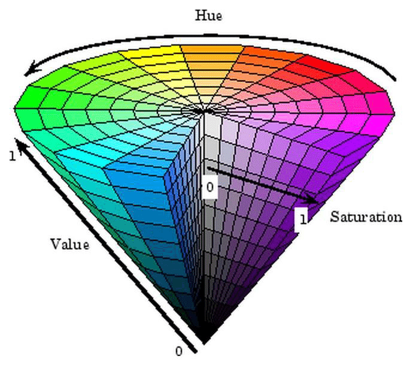

# Assignment 1: OpenCV setup and point operations

1. Capture an image from the laptop video camera.
2. Display the image:

3. The time spent capturing and processing each frame was found using `cv.getTickCount()` before and after all operations and then the tick counts are divided by `cv.getTickFrequency` (which gives clock cycles per second) to get the time. The inverse of the time is then the fps.

The cyan number is the "instantaneous" fps and the purple number below that is the averaged fps. The average fps was oscillating between 40 and 60 fps. So on average the processing time for one frame was about 17 to 25 ms.

However when I turned the ligths off in my room the average fps went up to a consistent 60 fps.

4. Locating the brightest spot and marking it the image:

The fps went down about a consistent 1 fps by using the bright spot detection. the green circled followed the white case very precisely, as it was reflecting light from my monitor very well.

5. Locating and marking the reddest spot in the image. To do that I converted the frame to HSV color space. First I made upper and lower bounds for the HSV values for red, that I decided myself. The "reddest" hue values in my opinion are between 0-10 and 160-180. So for the bounds for the hue I picked those values, I then chose for the saturation value 100-255 and for the "value" value i picked 20-255. The masks were created using `cv.inRange()` and then `cv.bitwise_and()` was used on the frame to extract the values of the pixels in my HSV range. Then using `cv.minMaxLoc()` on only the saturation values (so more saturation, more red), the "reddest" spot on the frame was found.  

 

 

On the picture above I am holding a Rubix cube and a multimeter, and the program decided that the multimeter is the reddest. 

 On the picture above here my lips were the reddest thing on the picture. The fps went down about 10 fps while detecting both the most bright and reddest spots.

6. Now searching for the brightest spot using a double for loop the fps dropped dramatically, all the way down to around 18 fps. It is clear that the OpenCV code is much better optimized.

7.