# Assignment 2

## Part I - Line detector

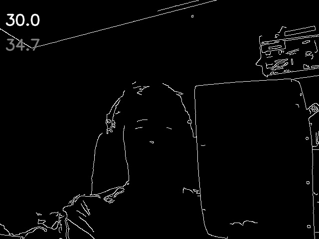

Example frame from using the Canny edge detector, with lower threshold 100 and upper threshold 200.

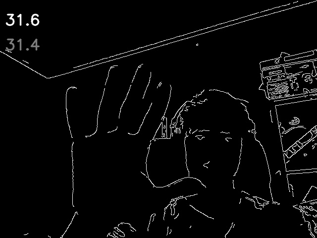

Again with, but with lower threshold 75 and upper threshold 125.

### RANSAC

After playing with the parameters I got the RANSAC algorithm to work. I halved the size of the image so the performance would be better. The number of samples was set at 20 and the distance threshold was at 5 pixels. Obviously it got better with more samples, but then the performance was really slow. With these parameters the fps was around 15 to 18. When holding the papar in front of the camera the line sometimes jumped from the edges on the closet and to the edges on the door. The line was displayed on the live image and the line follwed a sheet of paper very well. The processing time as can be seen from the fps counter was about 60 ms per frame.

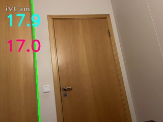

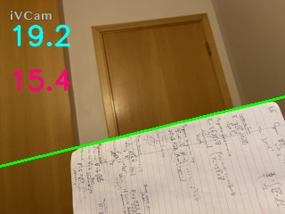

## Part II - Rectification

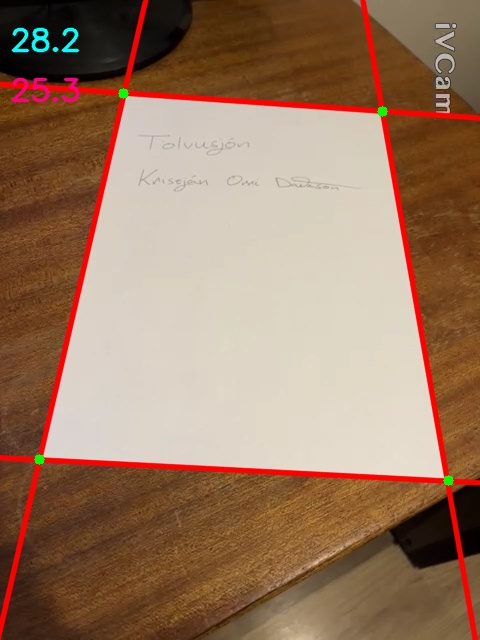

In the picture above there are 4 lines detected and 4 points of intersection. I have been trying to do a perspective transformation on the enclosed rectangular area, but it has not been working very well. For some reason the lines glitch in and out of the frame, so often it shows only 2 lines detected even though there are clearly 4 lines.

## A day later....

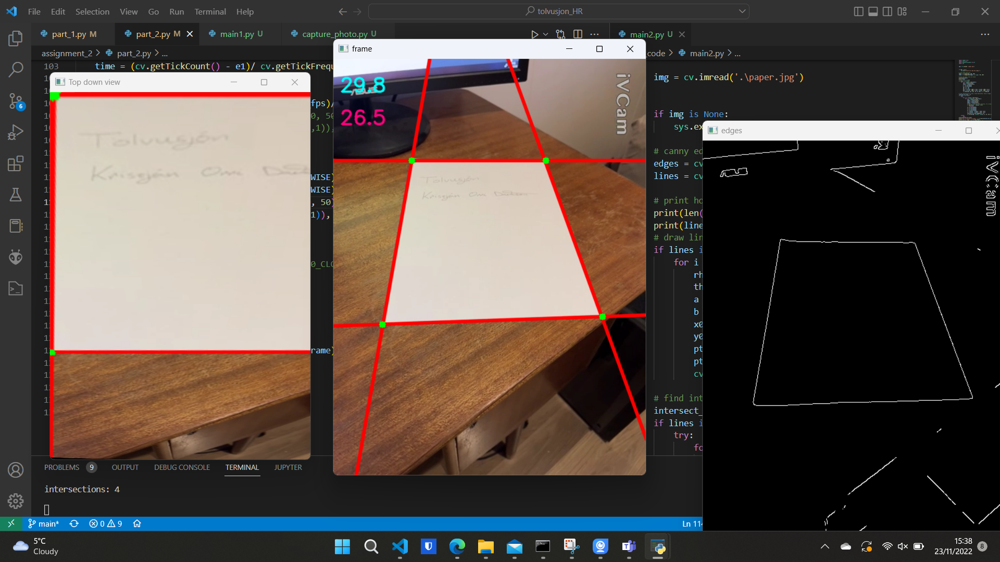

In the image above the primitive document scanner is almost working correctly. The problem is that I have to somehow get the program to be better at detecting the lines and the intersection points have to be put in the `cv.findHomography()` function in the correct order so the scanned image does not look way too distorted like in the image below. I took care of the lines glitching in and out by only displaying the rectified image when the intersection points are 4.

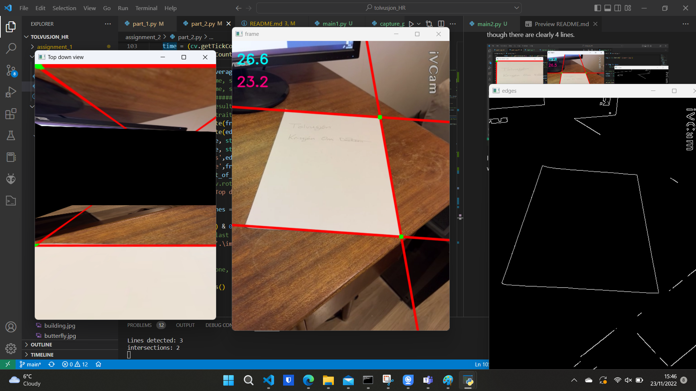

BUT, after a bit of trial and error and especially after sorting the intersection points (from lowest x value to highest) I got it to work. But it is worth meantioning that it only works from a certain perspective, i.e. when looking at the paper from the lower right side:

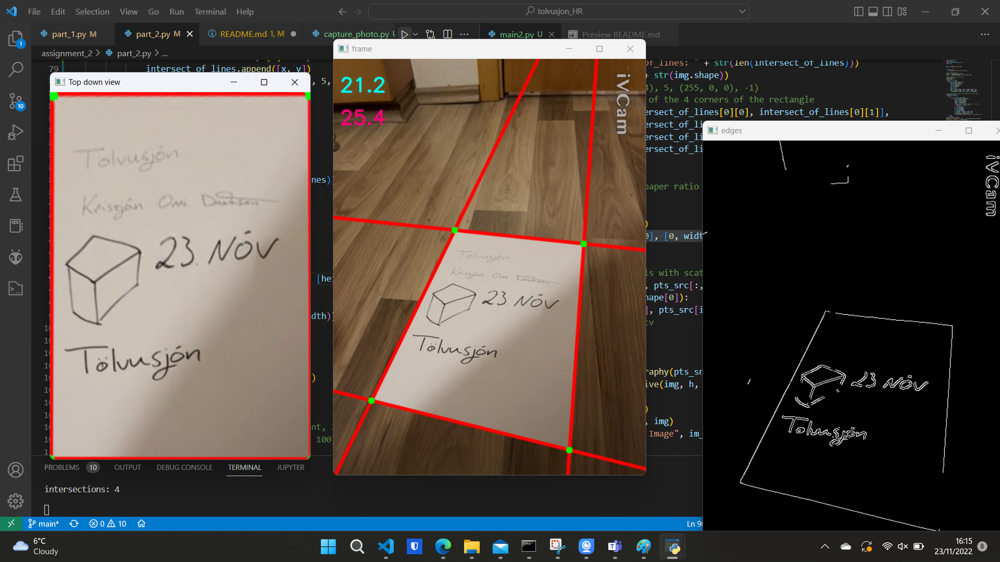

But when looked at from the lower left side, the document is mirrored:

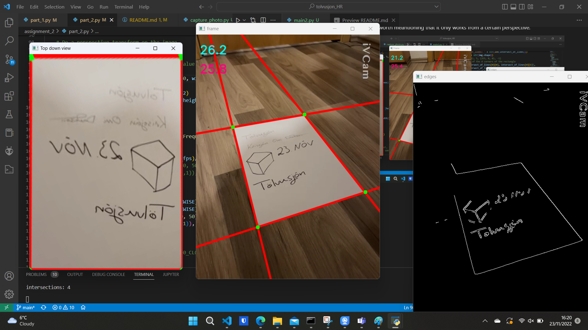

This was an easy fix, all I had to do was play around with the y values of the intersection points, until the scanned image was unmirrored when looking from at the paper from both sides. Here is the paper from the left perspective:

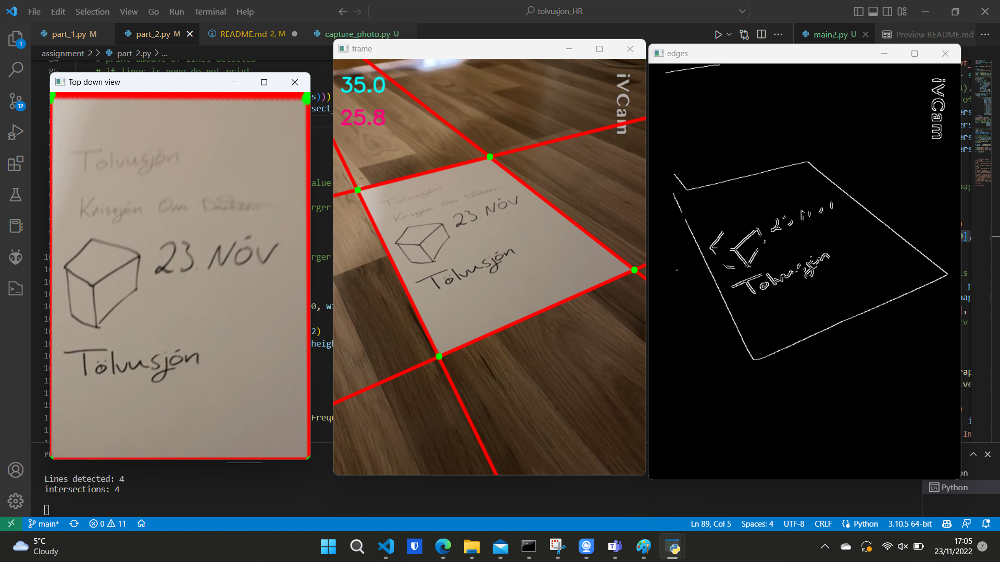

The program still does weird behaviour if it detects other 4 intersection points. It for example sometimes scans other areas of the image, if other lines interfere. Overall, using Hough lines, the processing time for each frame was about 40 ms (~25 fps), which was significantly better then using the custom made RANSAC method.

Some more examples:

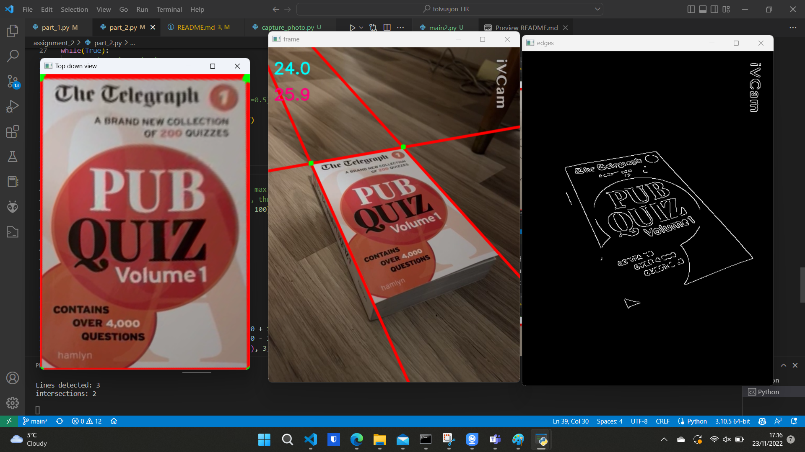

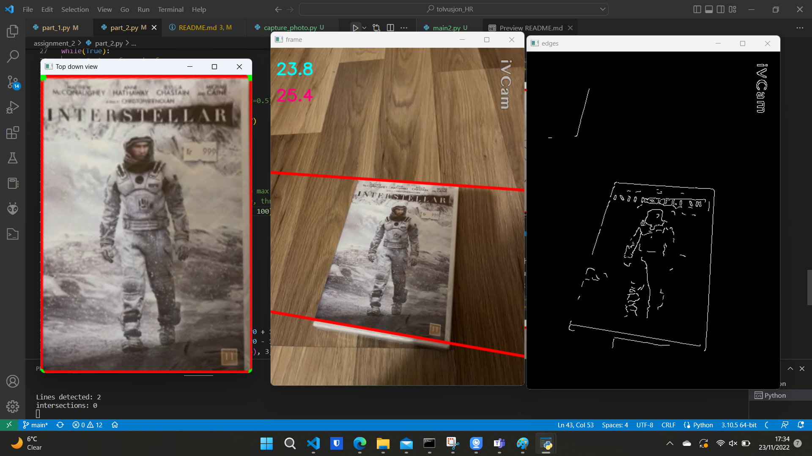