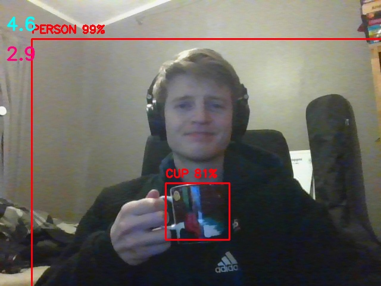
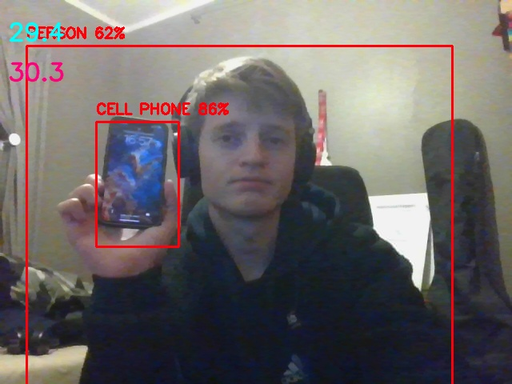
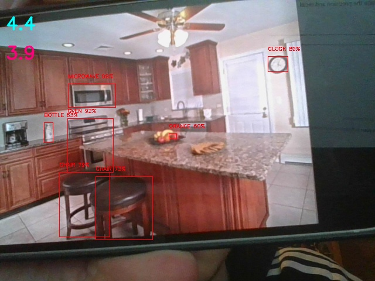

# Assignment 2 - Object detection using a pre-trained model

After following the tutorial, I got the DNN module with the Yolo v3 model to work. 

The image above is using the YOLOv3 model with image size 320 into the network. It was running about 3-4 fps on the CPU on my laptop which is pretty slow, but it was very accurate.

The image above shows the YOLOv3-tiny algorithm running and detecting a person and a cell phone. It ran significantly faster, as was expected.

By testing on my webcam and showing various things I would estimate that the proportion of positive identifications that were actually correct (precision) was about 50% with the 320 version and about 20-30% with the tiny version. I would also estimate that the recall with both the versions was about the same at about 60-70%.